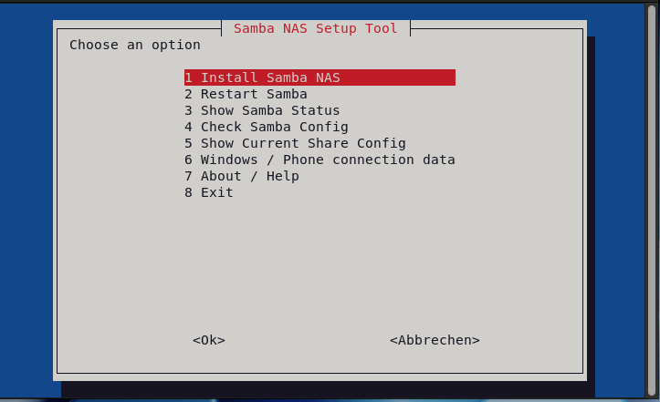

# 🖥️ Samba NAS Setup Tool

Interactive Samba NAS setup tool for Debian and Raspberry Pi OS.
Create and manage a network share in minutes — no manual config needed.

---

## 🚀 Features

* Interactive **whiptail menu** (raspi-config style)
* Automatic **Samba installation**
* Creates **Linux + Samba user**
* Creates and configures **NAS share**
* Automatically edits **smb.conf**
* Optional **guest access**
* Opens firewall (UFW) if enabled
* Shows **ready-to-use connection data**
* Status, config check & troubleshooting tools
* Modular structure (clean & extendable)

---

## 📸 Preview



---

## 📦 Requirements

* Debian / Ubuntu / Raspberry Pi OS
* sudo privileges
* Internet connection

Install dependencies:

```bash
sudo apt update
sudo apt install whiptail samba -y
```

---

## ⚙️ Installation

Clone the repository:

```bash
git clone git@github.com:sudoAndro/samba-nas-setup.git
cd samba-nas-setup
```

Start the tool:

```bash
bash menu.sh
```

---

## 🧰 Usage

After starting, you will see a menu like:

```text
1) Install Samba NAS
2) Restart Samba
3) Show Samba Status
4) Check Samba Config
5) Show Current Share Config
6) Windows / Phone connection data
7) About / Help
8) Exit
```

---

## 🔌 Connection Examples

### 🪟 Windows

```text
\\SERVER-IP\SHARENAME
```

Example:

```text
\\192.168.50.233\share
```

---

### 📱 Phone / File Manager

```text
smb://SERVER-IP/SHARENAME
```

Example:

```text
smb://192.168.50.233/share
```

---

## 🔐 Login Information

After installation, the tool shows:

* Server IP
* Share name
* Username
* Password (hidden)

⚠️ Important:

* **Username ≠ Share name**
* Use the correct credentials when connecting

---

## 📁 Project Structure

```text
samba-nas-setup
├─ menu.sh            # main menu
├─ common.sh          # shared functions (banner, helpers)
├─ functions.sh       # core logic
├─ install.sh         # optional installer
├─ uninstall.sh       # remove share config
├─ README.md
├─ docs
│  └─ setup.md
├─ examples
│  └─ smb-share-example.conf
└─ images
   └─ menu.png
```

---

## 🧠 How it works

The tool:

1. Installs Samba (if not installed)
2. Creates a Linux user
3. Creates a Samba user
4. Creates a share directory
5. Configures `/etc/samba/smb.conf`
6. Restarts Samba service
7. Stores last setup in:

```text
/etc/samba-nas-setup.conf
```

---

## 🧹 Uninstall

Run:

```bash
bash uninstall.sh
```

This removes:

* Samba share config from `smb.conf`

⚠️ It does NOT delete:

* user accounts
* share directories

(This is intentional to avoid data loss)

---

## ⚠️ Notes

* Do not run multiple setups with the same share name
* Always check config after changes
* Use menu option **4 (Check Samba Config)** if something fails

---

## 📖 Documentation

See:

```text
docs/setup.md
```

---

## 🧪 Example Config

See:

```text
examples/smb-share-example.conf
```

---

## 👤 Author

**sudoAndro**

---

## 📜 License

MIT License
